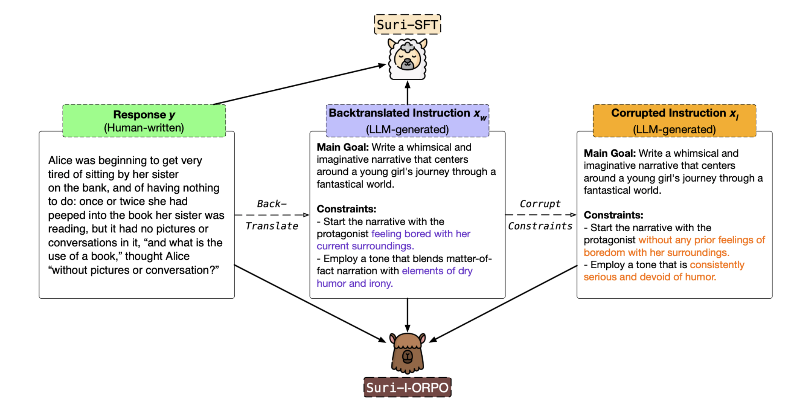

# 🦙 Suri: Multi-constraint Instruction Following for Long-form Text Generation

[]() [](https://chtmp223.github.io/suri) [](https://huggingface.co/chtmp223/suri) [](https://huggingface.co/chtmp223/suri-i-orpo) [](https://huggingface.co/chtmp223/suri-sft)


> This repository hosts the code and data for our preprint, [Suri: Multi-constraint instruction following for long-form text generation](arxiv). 

## 📣 Updates
- **[2024-06-25]**: The code and data for Suri is now available. 

## 📦 Using Suri
### Getting Started
1. Install the requirements for Suri:
    ```
    conda create -n suri python=3.10 
    conda activate suri
    pip install -r requirements.txt
    python -m pip install flash-attn --no-build-isolation
    huggingface-cli login       # Log in to Huggingface
    sudo apt-get install git-lfs
    ```
2. Set up the Huggingface cache directory:
    - Open your shell configuration file, which is typically `~/.bashrc` or `~/.bash_profile` for Bash, or `~/.zshrc` for Zsh. 
    - Add `HF_HOME` huggingface cache directory path to your configuration file: `HF_HOME=/path/to/huggingface_cache`
    - Save and close the file. Source the file to apply the changes: `source ~/.bashrc` or `source ~/.bash_profile` or `source ~/.zshrc`.
    - Double-check that the environment variable is set correctly: `echo $HF_HOME`. 

### Project Structure
TODO

### Dataset 
- The dataset is available on Huggingface: [https://huggingface.co/datasets/suri](https://huggingface.co/datasets/suri). 
- Due to copyright concerns, we only release the path of the sampled data from the Books3 subset. For interested users with access to the Books3 dataset, we include a script (`script/data/b3.py`) to reconstruct this portion of the dataset. Simply run ```python script/data/b3.py``` to generate the Books3 subset.

### I-ORPO & SFT implementation 
- The I-ORPO model is available on Huggingface: [https://huggingface.co/chtmp223/suri-i-orpo](https://huggingface.co/chtmp223/suri-i-orpo). The SFT model is available on Huggingface: [https://huggingface.co/chtmp223/suri-sft](https://huggingface.co/chtmp223/suri-sft).
- We include the code for training and evaluation in the `script/ft/` directory. Before getting started, ensure that the requirements are installed and the Huggingface cache directory is set up. See the README.md file in that folder for more information.


## 📜 Citation
If you find this work useful, please consider citing:
```

```